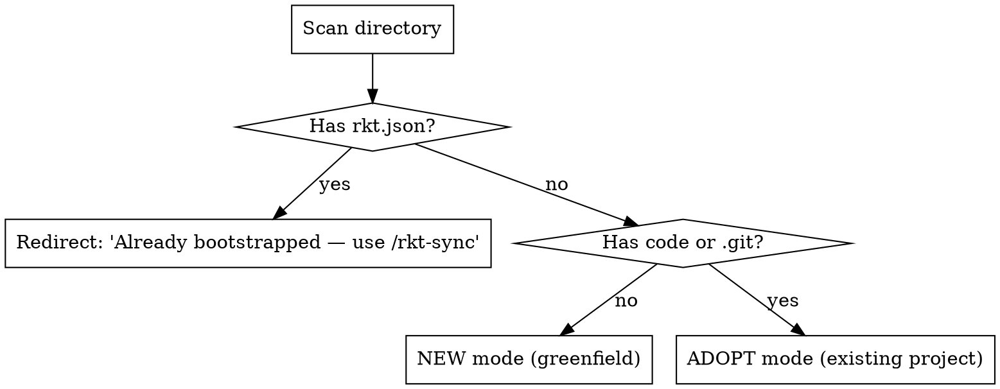
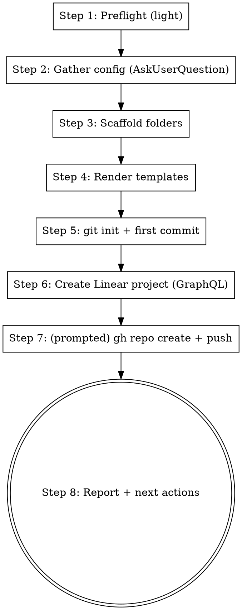
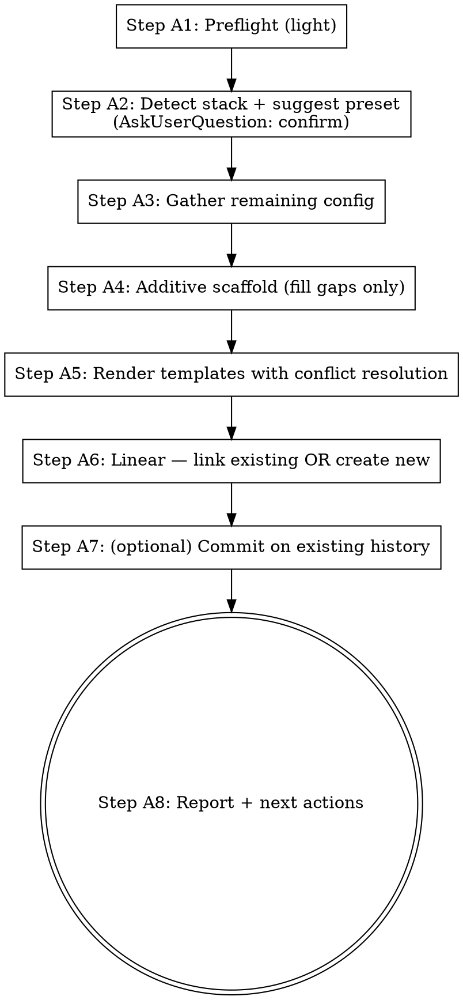
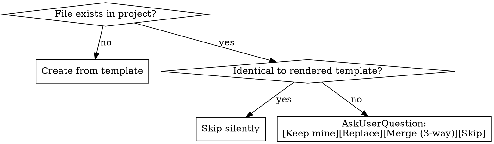

# rkt — Personal Claude Code Plugin Design

**Date:** 2026-04-17
**Status:** Approved (brainstorm phase complete)
**Author:** Davies Ayo

## Goal

Productize the development workflow built during Witness so that starting a
new project means typing one command and having everything wired up:
skills, agents, rules, git repo, Linear project, folder skeleton.

"Zero to hero every time I start something new."

## Non-Goals

- **Public product.** This is personal. Opinionated toward Davies's taste,
  stack preferences, and conventions. No abstraction for strangers.
- **Stack-agnostic generalization.** The plugin ships 4 opinionated presets,
  not a generic framework detector.
- **Replacing Xcode's project creation flow.** iOS projects are still
  created via Xcode → New Project → save into the `ios/` folder.
- **Full infrastructure provisioning.** Vercel/Railway/Supabase project
  creation is out of scope for MVP (still clicked through manually).

## Architecture

### Two layers

**Layer 1 — The plugin** (`~/.claude/plugins/daviesayo-rkt/`, installed once):

```
daviesayo-rkt/
├── .claude-plugin/plugin.json       # manifest, version, userConfig
├── skills/
│   ├── bootstrap/                   # NEW — scaffolds a new project
│   ├── rkt-sync/                    # NEW — updates project-owned templates
│   ├── implement/                   # ported from Witness, parameterized
│   ├── create-issue/                # ported, parameterized
│   ├── scan/                        # ported, parameterized
│   └── resolve-reviews/             # ported, parameterized
├── agents/                          # modular; presets pick subsets
│   ├── backend-implementer.md
│   ├── database-implementer.md
│   ├── ios-implementer.md
│   ├── web-implementer.md
│   └── code-reviewer.md
├── rules/                           # rule templates
│   ├── backend-fastapi.md
│   ├── supabase.md
│   ├── web-vite.md
│   ├── web-nextjs.md
│   └── ios-design.md
├── templates/                       # rendered into each new project
│   ├── AGENTS.md.tmpl
│   ├── PROGRESS.md.tmpl
│   ├── OPS.md.tmpl
│   ├── decisions.md.tmpl
│   ├── agent_learnings.md.tmpl
│   ├── README.md.tmpl
│   └── presets/
│       ├── full/                    # folder skeleton
│       ├── web/
│       ├── backend/
│       └── ios/
├── scripts/                         # worktree lifecycle
│   ├── new-feature.sh
│   ├── cleanup-feature.sh
│   └── cleanup-merged-worktrees.sh
└── bin/
    └── rkt                          # helper binary, PATH-added by plugin
```

**Layer 2 — The project** (created by `/bootstrap`):

```
my-new-project/
├── .claude/
│   └── rules/                       # copied from plugin, customizable
├── AGENTS.md                        # rendered from template
├── PROGRESS.md, OPS.md
├── decisions.md
├── docs/decisions/agent_learnings.md
├── rkt.json                         # per-project config
├── backend/ | ios/ | web/           # preset-dependent
└── README.md
```

Skills/agents/scripts live **only** in the plugin. The project holds only
project-specific context (AGENTS.md, rules the user customized, code, logs).

### Config split

| Lives in `userConfig` (plugin-level, prompted at install) | Lives in `rkt.json` (per-project) |
| :-------------------------------------------------------- | :-------------------------------- |
| Linear workspace / default team ID                        | Project name                      |
| Default iOS simulator/device name                         | Linear project ID                 |
| GitHub username/org                                       | Issue prefix (RKT, MCO, etc.)     |
| Default deploy targets (railway, vercel)                  | MemPalace specialist prefix      |
|                                                           | Preset used                       |
|                                                           | `rkt_plugin_version` at bootstrap |

`userConfig` values are accessed as `${user_config.KEY}` in plugin content
(per Claude Code plugin reference). Skills read `rkt.json` for per-project
values via `jq`.

## Presets

Four shipping presets; agents and rules are shared and composable.

### `full` — Witness-shape stack

```
{{project}}/
├── backend/                         # FastAPI, uv-managed
│   ├── app/main.py
│   ├── app/deps.py
│   ├── pyproject.toml
│   ├── supabase/migrations/
│   └── tests/
├── ios/{{project}}/                 # empty folder with README pointer
│   └── README.md                    # instructions for Xcode New Project
├── web/                             # Vite + React + TS
│   ├── src/
│   ├── package.json
│   └── vite.config.ts
├── .claude/rules/                   # backend, supabase, web-vite, ios-design
├── AGENTS.md                        # 4-domain rendered
└── rkt.json                         # deploy: railway + vercel + supabase
```

**Active agents:** all 5 (backend, database, ios, web, code-reviewer)

### `web` — Next.js + Supabase

```
{{project}}/
├── app/                             # Next.js 16 App Router
├── components/
├── lib/supabase.ts
├── supabase/migrations/
├── package.json
├── .claude/rules/                   # web-nextjs, supabase
├── AGENTS.md                        # 2-domain rendered
└── rkt.json                         # deploy: vercel + supabase
```

**Active agents:** web, database, code-reviewer

Leverages existing `vercel:*` plugin skills automatically.

### `backend` — FastAPI API service

```
{{project}}/
├── app/main.py
├── app/deps.py
├── supabase/migrations/
├── pyproject.toml
├── tests/
├── .claude/rules/                   # backend-fastapi, supabase
├── AGENTS.md                        # 2-domain rendered
└── rkt.json                         # deploy: railway + supabase
```

**Active agents:** backend, database, code-reviewer

### `ios` — SwiftUI client (standalone)

```
{{project}}/
├── {{project}}/                     # Xcode project location
│   └── README.md                    # Xcode New Project instructions
├── .claude/rules/                   # ios-design
├── AGENTS.md                        # 1-domain rendered
└── rkt.json                         # deploy: — (none)
```

**Active agents:** ios, code-reviewer

### iOS scaffolding note

No official Xcode CLI generates new iOS app projects. For MVP, bootstrap
creates the `ios/` folder with a README giving explicit manual steps (bundle
ID suggestion, capabilities checklist). `/implement` begins real work once
the user has done Xcode → New Project.

If iOS project creation ever becomes a real bottleneck, an `--xcodegen` flag
can be added later.

## Bootstrap Flow

`/bootstrap [preset] [name]` — invoked in any target directory. The skill
detects the current state of the directory and branches into one of three
paths: NEW (greenfield), ADOPT (existing project, never rkt'd), or redirect
to `/rkt-sync` (already bootstrapped).

### State detection (runs first, always)



Detection signals checked during scan:

| Signal                                       | Used for                                |
| :------------------------------------------- | :-------------------------------------- |
| `rkt.json` exists                            | Short-circuit → `/rkt-sync`             |
| `.git/` exists                               | Skip `git init`                         |
| `.git/config` has remote                     | Skip `gh repo create`                   |
| `package.json` contains `"next"`             | Suggest `web` preset (Next.js)          |
| `package.json` contains `"react"` + `"vite"` | Suggest `web` preset (Vite variant)     |
| `pyproject.toml` contains `"fastapi"`        | Suggests `backend` component            |
| `*.xcodeproj` or `*.xcworkspace` at root     | Suggests `ios` component                |
| `supabase/migrations/` exists                | Signals Supabase in use                 |
| Multiple of the above                        | Suggest `full`                          |
| Existing `AGENTS.md` / `decisions.md`        | Mark for conflict resolution            |

### NEW mode (greenfield)



### Step 1 — Preflight (light, MVP)

Run `which linear gh git jq` and similar. If any are missing, warn the user
and list which steps will fail. Do **not** auto-install — that's deferred to
a later version (see Deferred section).

### Step 2 — Gather config (AskUserQuestion throughout)

For each of these, present choices via `AskUserQuestion`:

- **Preset** — if not passed as argument, menu of `full / web / backend / ios`
- **Issue prefix** — auto-derive from project name (`my-new-thing` → `MNT`),
  present as suggestion with options `[Accept] [Customize] [Cancel]`
- **Linear team** — if user has multiple teams; skip if only one
- **GitHub repo** — `[Create private] [Create public] [Skip]`
- **Starting MemPalace specialist prefix** — default to project name;
  offer override

### Step 3 — Scaffold folders

Copy `templates/presets/{preset}/` contents into the project directory.
Folder structure and stub files are per-preset (see Presets section).

### Step 4 — Render templates

Substitute `{{PROJECT_NAME}}`, `{{LINEAR_PREFIX}}`, `{{MEMPALACE_PREFIX}}`,
`{{PRESET}}`, `{{RKT_VERSION}}` into:

- `AGENTS.md`
- `PROGRESS.md`
- `OPS.md`
- `decisions.md`
- `docs/decisions/agent_learnings.md`
- `README.md`

Write `rkt.json` with all resolved values.

### Step 5 — git init + first commit

```bash
git init -b main
git add .
git commit -m "[bootstrap] Initialize {{PROJECT_NAME}} ({{PRESET}})"
```

### Step 6 — Create Linear project

Use `linear api` GraphQL passthrough (the CLI does not expose
`project create` directly):

```graphql
mutation($name: String!, $teamId: String!) {
  projectCreate(input: { name: $name, teamIds: [$teamId] }) {
    project { id name url }
  }
}
```

Store project ID in `rkt.json`.

### Step 7 — GitHub repo (prompted, not assumed)

If user chose yes in Step 2:

```bash
gh repo create "$PROJECT_NAME" --private --source=. --remote=origin --push
```

### Step 8 — Report

Show Linear URL, GitHub URL, preset used, and next-step suggestions
(`/scan`, `/create-issue`, `/implement`).

### ADOPT mode (existing project)

Non-destructive by default. Every conflict surfaces as an explicit choice.



#### Step A2 — Detect stack + suggest preset

Run the detection heuristics from the state-detection table. Present the
suggestion via `AskUserQuestion`:

> "I detected a Next.js 16 project using Supabase. Apply `web` preset?"
>
> `[Yes, apply web]` `[Different preset]` `[Cancel]`

Detection is always a *suggestion*, never a silent override. If the user
picks "Different preset", present the full preset menu.

#### Step A3 — Gather remaining config

Same prompts as NEW mode Step 2, but:

- Skip `git init` prompts — the repo exists
- **GitHub repo**: default to "Skip" if remote already exists; otherwise
  offer the normal `[Create private] [Create public] [Skip]` menu
- **Linear**: see Step A6
- Issue prefix auto-derivation may prefer existing git remote's repo name
  over the directory name, if they differ

#### Step A4 — Additive scaffold (fill gaps only)

Compare preset's expected folder structure against what exists:

- Folder exists → skip
- Folder missing → create
- File in scaffold exists → do not overwrite; hand off to Step A5

Never deletes or replaces existing user code.

#### Step A5 — Render templates with per-file conflict resolution

For each template file (AGENTS.md, PROGRESS.md, OPS.md, decisions.md,
agent_learnings.md, README.md, each rule in `.claude/rules/`):



The four choices per conflict:

| Choice    | Behavior                                                         |
| :-------- | :--------------------------------------------------------------- |
| Keep mine | Leave the existing file untouched                                |
| Replace   | Overwrite with the freshly-rendered template                     |
| Merge     | 3-way merge — opens the user's editor with conflict markers      |
| Skip      | Same as Keep mine, but flag in report as "user deferred"         |

Rules in `.claude/rules/` follow the same conflict flow. If the project
already has rules the plugin doesn't ship, leave them alone.

#### Step A6 — Linear: link existing or create new

`AskUserQuestion`:

> "Is there an existing Linear project for this repo?"
>
> `[Link existing (paste URL)]` `[Create new]` `[Skip Linear integration]`

If "Link existing": prompt for the Linear project URL, parse team ID and
project ID, store in `rkt.json`.
If "Create new": same GraphQL mutation as NEW mode Step 6.
If "Skip": `rkt.json.linear` fields set to `null`. Skills gracefully
degrade (warn but don't fail) when Linear config is absent.

#### Step A7 — Commit on existing history

If `.git/` exists:

```bash
git add .
git commit -m "[rkt] Add workflow tooling and project scaffolding"
```

(Not `[bootstrap] Initialize …` — that would mis-state what happened.)

If `.git/` does not exist, fall through to NEW mode Step 5 behavior.

#### Step A8 — Report

Summarize what was added, what conflicts were resolved, and what was
skipped:

> **✓ Applied `web` preset to existing project**
>
> Added: `.claude/rules/web-nextjs.md`, `.claude/rules/supabase.md`,
> `PROGRESS.md`, `OPS.md`, `decisions.md`, `docs/decisions/agent_learnings.md`,
> `rkt.json`
>
> Conflicts resolved: `AGENTS.md` → merged (your existing doc + new sections)
>
> Skipped: `README.md` (kept yours)
>
> Linear: linked existing project https://linear.app/...
>
> GitHub: existing remote `origin` (skipped repo creation)
>
> **Next steps:** Run `/scan` to populate the backlog, or `/implement` an
> existing Linear issue.

### What NOT to auto-detect (always ask)

- **The preset itself** — detection is a suggestion, always confirm
- **MemPalace prefix** — too important to guess silently
- **Linear: link vs. create** — context-dependent, always ask
- **Conflict resolution** — never silently merge or overwrite

## Ported Skills

These exist in Witness and need parameterization via `rkt.json` / `userConfig`:

| Skill               | Changes needed                                                |
| :------------------ | :------------------------------------------------------------ |
| `/implement`        | Read project name, issue prefix, MemPalace prefix from config |
| `/create-issue`     | Read Linear project ID, issue prefix, labels from config      |
| `/scan`             | Read Linear project ID from config                            |
| `/resolve-reviews`  | No changes (already project-agnostic)                         |

All prompts in these skills switch from text/bash to `AskUserQuestion`.

## New Skills

### `/bootstrap <preset> <name>`

Scaffolds a new project as described in Bootstrap Flow.

### `/rkt-sync`

Updates **plugin-managed** project files (AGENTS.md, generic rules in
`.claude/rules/`, PROGRESS.md template sections) when the plugin has shipped
new template versions.

**Preserves project-owned content** across sync:
- Files matching `.claude/rules/project-*.md` — never touched
- Files matching `agents/*.project.md` in the project — never touched
- User-edited sections within plugin-managed files demarcated by sentinel
  markers: `<!-- rkt-managed:start -->` … `<!-- rkt-managed:end -->`. Sync
  only replaces content inside these blocks; anything outside is user
  territory.
- `decisions.md`, `docs/decisions/agent_learnings.md` — append-only logs;
  sync only creates them if absent, never overwrites existing entries.

Flow:

1. Read `rkt_plugin_version` from project's `rkt.json`
2. Read installed plugin version
3. Surface `CHANGELOG.md` entries between old and new versions
4. For each plugin-managed template file:
   - Project file absent → create from template
   - Project file present, sentinel-block diff → offer
     `[Accept update] [Keep mine] [Show 3-way merge]` via `AskUserQuestion`
   - Project file present, no sentinel blocks (user has fully taken over) →
     warn and skip (user opted out of managed sections)
5. Update `rkt_plugin_version` in `rkt.json` on completion

**In MVP scope** (confirmed during brainstorm).

### `/rkt-tailor`

Project-specific knowledge capture. Runs **after** bootstrap, once the
project has real code, decisions, and domain patterns. Analogous to
`claude init` but for this project's rkt overlay: scans the codebase and
context files, then writes project-specific rules and agent overlays that
encode the project's actual conventions and business logic.

**Why this exists (separate from bootstrap):** plugin-level agents and rules
cover **generic stack conventions** (FastAPI async patterns, Supabase RLS,
SwiftUI design tokens). Project-specific business rules (split math rules,
cool-off mechanics, audit ordering invariants, company conventions) are
discovered over time and don't belong in the shared plugin. `/rkt-tailor`
is how they get captured into the project's own `.claude/` overlay.

Flow:

1. Read `rkt.json` to confirm the project is bootstrapped
2. Read `AGENTS.md`, `PROGRESS.md`, `decisions.md`, `docs/decisions/agent_learnings.md`
3. Scan the actual codebase for domain concepts (routes, models, tables,
   swift types, react routes)
4. Interactively, via `AskUserQuestion`, surface candidate patterns:
   > "I see your backend uses a `cooloff` status on contributors with a
   > `cooloff_ends_at` timestamp. Should I capture this as a rule for the
   > backend-implementer to enforce?"
   > `[Yes, add rule]` `[Skip]` `[Customize description]`
5. For accepted patterns, write into the project overlay:
   - `.claude/rules/project-backend.md` — backend-specific business rules
   - `.claude/rules/project-database.md` — schema invariants, migration patterns
   - `.claude/rules/project-ios.md` — iOS-specific UI/state patterns
   - `.claude/rules/project-web.md` — web-specific patterns
   - `agents/*.project.md` — agent-level overlays if the agent itself needs
     project-specific instructions (append-loaded by the agent at task start)
6. These files are **project-owned** — `/rkt-sync` never touches them.

Re-runnable: the skill reads its previous output and shows diffs of
current-project reality vs. previously-captured rules, offering to update
or leave as-is.

**Activation:** Davies runs `/rkt-tailor` manually when the project has
evolved enough to codify patterns (typically after the first few meaningful
features). Not triggered by bootstrap.

**In MVP scope** (added after initial design based on execution feedback —
the Witness-specific business rules that leaked into ported agents during
implementation confirmed this skill is load-bearing, not optional).

## Agents

All 5 agents are **generic stack conventions only** — no project-specific
business logic. That lives in project-owned overlays written by
`/rkt-tailor` (see above).

Plugin-level agents cover:

| Agent                  | Generic concerns                                                       |
| :--------------------- | :--------------------------------------------------------------------- |
| `backend-implementer`  | FastAPI async, Pydantic validation, Supabase client conventions, tests |
| `database-implementer` | Supabase migrations, RLS patterns, RPC function idioms, OPS.md sync    |
| `ios-implementer`      | SwiftUI patterns, iOS 26+ features, design tokens, device builds       |
| `web-implementer`      | Vite/Next.js build, Server Components, Tailwind, routing               |
| `code-reviewer`        | Security/convention checklists gated on detected stack                 |

Parameterization:

- Device name (iOS) — from `user_config.default_ios_device`
- MemPalace write targets — use `${project.mempalace_prefix}-architect` etc.
- Linear issue prefix — from `rkt.json`
- No hardcoded project names, no domain business rules

Agents stay **lean workers** — they don't read AGENTS.md, MemPalace, or
decisions.md themselves. The orchestrator (`/implement`) gathers context
once and injects relevant bits into each agent's spawn prompt.

**Project-specific overlays:** if a project has `agents/backend-implementer.project.md`
in its `.claude/` directory, the backend-implementer loads that at task
start. The overlay contains business rules (e.g., "cool-off timestamps
are 48h", "splits must sum to 100%"). Written by `/rkt-tailor`.

## Rules

Two tiers of rules:

**Plugin-shipped (generic stack conventions):**

| Rule file            | Active when editing                 |
| :------------------- | :---------------------------------- |
| `backend-fastapi.md` | `backend/app/**/*.py`               |
| `supabase.md`        | `**/supabase/**`                    |
| `web-vite.md`        | `web/src/**` (Vite preset only)     |
| `web-nextjs.md`      | `app/**`, `components/**` (Next.js) |
| `ios-design.md`      | `ios/**/*.swift`                    |

These are copied into `.claude/rules/` at bootstrap and updated by
`/rkt-sync` (with sentinel markers preserving user edits).

**Project-owned (domain business rules):**

Written by `/rkt-tailor`. Filename prefix `project-*` to signal "do not
touch during sync":

- `.claude/rules/project-backend.md`
- `.claude/rules/project-database.md`
- `.claude/rules/project-ios.md`
- `.claude/rules/project-web.md`

Same `appliesTo` path patterns as the corresponding plugin rule. Claude
Code loads both when files in those paths are edited.

## Evolution Model

### Plugin-owned things (auto-update)

Skills, agents, scripts, rule source templates, helper binaries — all live in
the plugin. Updated via:

```bash
claude plugin update rkt
```

No per-project action needed. Every project picks up the change on next
session.

### Project-owned things (manual sync)

`AGENTS.md`, rules in `.claude/rules/`, log files — rendered at bootstrap and
customized by the user. Updated via:

```
/rkt-sync
```

Which shows diffs and asks for per-file decisions.

## UX Principles

- **All prompts use `AskUserQuestion`.** No bash `read`, no "type y/n". This
  is a Claude-invoked workflow — it should feel native inside Claude Code.
- **`AskUserQuestion` also for classification gates** in `/resolve-reviews`,
  `/scan`, etc. — structured choices, not raw text interpretation.
- **Preflight failures show an actionable table**, not a vague error.
- **Bootstrap reports end with next-step suggestions** so the user never
  wonders "ok what now?".

## MVP Scope

**In MVP:**

- Plugin distributed via `daviesayo-marketplace` (own GitHub repo with
  `marketplace.json`)
- All 4 presets (`full`, `web`, `backend`, `ios`)
- `/bootstrap` with state detection + both NEW and ADOPT modes
  - NEW: preflight → gather → scaffold → render → git init → Linear →
    gh repo → report
  - ADOPT: preflight → detect → gather → additive scaffold → render with
    per-file conflict resolution → Linear (link or create) → commit on
    existing history → report
  - Short-circuit to `/rkt-sync` if `rkt.json` already present
- `/rkt-sync` — preserves project-owned files (`project-*.md` rules, `*.project.md`
  agent overlays) and user-edited sections demarcated by sentinel markers
- `/rkt-tailor` — scans project, captures domain business rules into project-owned
  overlays; re-runnable as project evolves
- 5 agents ported and parameterized — **generic stack conventions only**, no
  project-specific business logic
- 4 skills ported and parameterized (`/implement`, `/create-issue`, `/scan`,
  `/resolve-reviews`)
- All prompts via `AskUserQuestion`
- iOS scaffolding is a README pointer (Option A)

**Deferred to later:**

- Preflight auto-install missing dependencies via Homebrew
- Vercel/Railway/Supabase project creation at bootstrap
- Seeding initial Linear issues
- CI workflow templates (GitHub Actions)
- `xcodegen` integration for iOS
- Additional presets (CLI tool, mobile + backend without web, etc.)

## Open Questions

None blocking. All pivotal decisions have been resolved during the brainstorm
session (2026-04-17).

## Acceptance Criteria

The MVP is done when Davies can:

1. Install the plugin: `claude plugin install rkt@daviesayo-marketplace`
2. **Greenfield path:** create an empty directory, `cd` into it, run
   `claude`, type `/bootstrap full my-new-thing`, answer the prompts,
   and end up with a fully-wired project (git initialized, Linear
   project created, folder skeleton in place, AGENTS.md rendered,
   and if opted in a GitHub repo pushed)
3. **Adopt path:** `cd` into an existing repo (e.g., a GitHub fork),
   run `claude`, type `/bootstrap`, confirm the auto-detected preset,
   resolve any template conflicts via `AskUserQuestion`, and end up
   with workflow tooling layered on top of the existing code
   without anything being overwritten silently
4. **Re-run safety:** running `/bootstrap` a second time in a
   bootstrapped project redirects to `/rkt-sync` rather than re-running
5. Run `/create-issue`, `/implement`, `/resolve-reviews` against either
   kind of project with zero additional configuration
6. Run `/rkt-tailor` after the project has real code, interactively
   capture project-specific business rules into `.claude/rules/project-*.md`
   and `agents/*.project.md` overlays
7. Run `/rkt-sync` months later to pick up plugin template improvements
   without losing project-owned overlays or user-edited sections

## References

- Claude Code plugin reference: https://code.claude.com/docs/en/plugins-reference
- Witness project (source of the ported skills/agents):
  `/Users/rocket/Documents/Repositories/witness`
