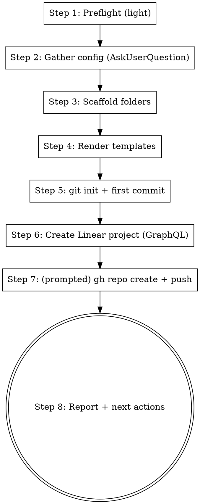

# rkt — Personal Claude Code Plugin Design

**Date:** 2026-04-17
**Status:** Approved (brainstorm phase complete)
**Author:** Davies Ayo

## Goal

Productize the development workflow built during Witness so that starting a
new project means typing one command and having everything wired up:
skills, agents, rules, git repo, Linear project, folder skeleton.

"Zero to hero every time I start something new."

## Non-Goals

- **Public product.** This is personal. Opinionated toward Davies's taste,
  stack preferences, and conventions. No abstraction for strangers.
- **Stack-agnostic generalization.** The plugin ships 4 opinionated presets,
  not a generic framework detector.
- **Replacing Xcode's project creation flow.** iOS projects are still
  created via Xcode → New Project → save into the `ios/` folder.
- **Full infrastructure provisioning.** Vercel/Railway/Supabase project
  creation is out of scope for MVP (still clicked through manually).

## Architecture

### Two layers

**Layer 1 — The plugin** (`~/.claude/plugins/daviesayo-rkt/`, installed once):

```
daviesayo-rkt/
├── .claude-plugin/plugin.json       # manifest, version, userConfig
├── skills/
│   ├── bootstrap/                   # NEW — scaffolds a new project
│   ├── rkt-sync/                    # NEW — updates project-owned templates
│   ├── implement/                   # ported from Witness, parameterized
│   ├── create-issue/                # ported, parameterized
│   ├── scan/                        # ported, parameterized
│   └── resolve-reviews/             # ported, parameterized
├── agents/                          # modular; presets pick subsets
│   ├── backend-implementer.md
│   ├── database-implementer.md
│   ├── ios-implementer.md
│   ├── web-implementer.md
│   └── code-reviewer.md
├── rules/                           # rule templates
│   ├── backend-fastapi.md
│   ├── supabase.md
│   ├── web-vite.md
│   ├── web-nextjs.md
│   └── ios-design.md
├── templates/                       # rendered into each new project
│   ├── AGENTS.md.tmpl
│   ├── PROGRESS.md.tmpl
│   ├── OPS.md.tmpl
│   ├── decisions.md.tmpl
│   ├── agent_learnings.md.tmpl
│   ├── README.md.tmpl
│   └── presets/
│       ├── full/                    # folder skeleton
│       ├── web/
│       ├── backend/
│       └── ios/
├── scripts/                         # worktree lifecycle
│   ├── new-feature.sh
│   ├── cleanup-feature.sh
│   └── cleanup-merged-worktrees.sh
└── bin/
    └── rkt                          # helper binary, PATH-added by plugin
```

**Layer 2 — The project** (created by `/bootstrap`):

```
my-new-project/
├── .claude/
│   └── rules/                       # copied from plugin, customizable
├── AGENTS.md                        # rendered from template
├── PROGRESS.md, OPS.md
├── decisions.md
├── docs/decisions/agent_learnings.md
├── rkt.json                         # per-project config
├── backend/ | ios/ | web/           # preset-dependent
└── README.md
```

Skills/agents/scripts live **only** in the plugin. The project holds only
project-specific context (AGENTS.md, rules the user customized, code, logs).

### Config split

| Lives in `userConfig` (plugin-level, prompted at install) | Lives in `rkt.json` (per-project) |
| :-------------------------------------------------------- | :-------------------------------- |
| Linear workspace / default team ID                        | Project name                      |
| Default iOS simulator/device name                         | Linear project ID                 |
| GitHub username/org                                       | Issue prefix (RKT, MCO, etc.)     |
| Default deploy targets (railway, vercel)                  | MemPalace specialist prefix      |
|                                                           | Preset used                       |
|                                                           | `rkt_plugin_version` at bootstrap |

`userConfig` values are accessed as `${user_config.KEY}` in plugin content
(per Claude Code plugin reference). Skills read `rkt.json` for per-project
values via `jq`.

## Presets

Four shipping presets; agents and rules are shared and composable.

### `full` — Witness-shape stack

```
{{project}}/
├── backend/                         # FastAPI, uv-managed
│   ├── app/main.py
│   ├── app/deps.py
│   ├── pyproject.toml
│   ├── supabase/migrations/
│   └── tests/
├── ios/{{project}}/                 # empty folder with README pointer
│   └── README.md                    # instructions for Xcode New Project
├── web/                             # Vite + React + TS
│   ├── src/
│   ├── package.json
│   └── vite.config.ts
├── .claude/rules/                   # backend, supabase, web-vite, ios-design
├── AGENTS.md                        # 4-domain rendered
└── rkt.json                         # deploy: railway + vercel + supabase
```

**Active agents:** all 5 (backend, database, ios, web, code-reviewer)

### `web` — Next.js + Supabase

```
{{project}}/
├── app/                             # Next.js 16 App Router
├── components/
├── lib/supabase.ts
├── supabase/migrations/
├── package.json
├── .claude/rules/                   # web-nextjs, supabase
├── AGENTS.md                        # 2-domain rendered
└── rkt.json                         # deploy: vercel + supabase
```

**Active agents:** web, database, code-reviewer

Leverages existing `vercel:*` plugin skills automatically.

### `backend` — FastAPI API service

```
{{project}}/
├── app/main.py
├── app/deps.py
├── supabase/migrations/
├── pyproject.toml
├── tests/
├── .claude/rules/                   # backend-fastapi, supabase
├── AGENTS.md                        # 2-domain rendered
└── rkt.json                         # deploy: railway + supabase
```

**Active agents:** backend, database, code-reviewer

### `ios` — SwiftUI client (standalone)

```
{{project}}/
├── {{project}}/                     # Xcode project location
│   └── README.md                    # Xcode New Project instructions
├── .claude/rules/                   # ios-design
├── AGENTS.md                        # 1-domain rendered
└── rkt.json                         # deploy: — (none)
```

**Active agents:** ios, code-reviewer

### iOS scaffolding note

No official Xcode CLI generates new iOS app projects. For MVP, bootstrap
creates the `ios/` folder with a README giving explicit manual steps (bundle
ID suggestion, capabilities checklist). `/implement` begins real work once
the user has done Xcode → New Project.

If iOS project creation ever becomes a real bottleneck, an `--xcodegen` flag
can be added later.

## Bootstrap Flow

`/bootstrap <preset> <name>` — invoked in an empty target directory.



### Step 1 — Preflight (light, MVP)

Run `which linear gh git jq` and similar. If any are missing, warn the user
and list which steps will fail. Do **not** auto-install — that's deferred to
a later version (see Deferred section).

### Step 2 — Gather config (AskUserQuestion throughout)

For each of these, present choices via `AskUserQuestion`:

- **Preset** — if not passed as argument, menu of `full / web / backend / ios`
- **Issue prefix** — auto-derive from project name (`my-new-thing` → `MNT`),
  present as suggestion with options `[Accept] [Customize] [Cancel]`
- **Linear team** — if user has multiple teams; skip if only one
- **GitHub repo** — `[Create private] [Create public] [Skip]`
- **Starting MemPalace specialist prefix** — default to project name;
  offer override

### Step 3 — Scaffold folders

Copy `templates/presets/{preset}/` contents into the project directory.
Folder structure and stub files are per-preset (see Presets section).

### Step 4 — Render templates

Substitute `{{PROJECT_NAME}}`, `{{LINEAR_PREFIX}}`, `{{MEMPALACE_PREFIX}}`,
`{{PRESET}}`, `{{RKT_VERSION}}` into:

- `AGENTS.md`
- `PROGRESS.md`
- `OPS.md`
- `decisions.md`
- `docs/decisions/agent_learnings.md`
- `README.md`

Write `rkt.json` with all resolved values.

### Step 5 — git init + first commit

```bash
git init -b main
git add .
git commit -m "[bootstrap] Initialize {{PROJECT_NAME}} ({{PRESET}})"
```

### Step 6 — Create Linear project

Use `linear api` GraphQL passthrough (the CLI does not expose
`project create` directly):

```graphql
mutation($name: String!, $teamId: String!) {
  projectCreate(input: { name: $name, teamIds: [$teamId] }) {
    project { id name url }
  }
}
```

Store project ID in `rkt.json`.

### Step 7 — GitHub repo (prompted, not assumed)

If user chose yes in Step 2:

```bash
gh repo create "$PROJECT_NAME" --private --source=. --remote=origin --push
```

### Step 8 — Report

Show Linear URL, GitHub URL, preset used, and next-step suggestions
(`/scan`, `/create-issue`, `/implement`).

## Ported Skills

These exist in Witness and need parameterization via `rkt.json` / `userConfig`:

| Skill               | Changes needed                                                |
| :------------------ | :------------------------------------------------------------ |
| `/implement`        | Read project name, issue prefix, MemPalace prefix from config |
| `/create-issue`     | Read Linear project ID, issue prefix, labels from config      |
| `/scan`             | Read Linear project ID from config                            |
| `/resolve-reviews`  | No changes (already project-agnostic)                         |

All prompts in these skills switch from text/bash to `AskUserQuestion`.

## New Skills

### `/bootstrap <preset> <name>`

Scaffolds a new project as described in Bootstrap Flow.

### `/rkt-sync`

Updates project-owned templates (AGENTS.md, rules in `.claude/rules/`,
PROGRESS.md) when the plugin has shipped new template versions.

Flow:

1. Read `rkt_plugin_version` from project's `rkt.json`
2. Read installed plugin version
3. For each template file, diff project version vs. current plugin version
4. For each diff, ask `[Accept update] [Keep mine] [Show 3-way merge]` via
   `AskUserQuestion`
5. Update `rkt_plugin_version` in `rkt.json` on completion
6. Surface `CHANGELOG.md` entries between old and new versions in the report

**In MVP scope** (confirmed during brainstorm).

## Agents

All 5 agents ported from Witness. Parameterization:

- Device name (iOS) — from `user_config.default_ios_device`
- MemPalace write targets — use `${project.mempalace_prefix}-architect` etc.
- Linear issue prefix — from `rkt.json`
- No hardcoded project names or paths

Agents stay **lean workers** — they don't read AGENTS.md, MemPalace, or
decisions.md themselves. The orchestrator (`/implement`) gathers context once
and injects relevant bits into each agent's spawn prompt. Same pattern as
current Witness setup.

## Rules

Rules are copied into `.claude/rules/` at bootstrap time so they can be
customized per-project.

| Rule file            | Active when editing                 |
| :------------------- | :---------------------------------- |
| `backend-fastapi.md` | `backend/app/**/*.py`               |
| `supabase.md`        | `**/supabase/**`                    |
| `web-vite.md`        | `web/src/**` (Vite preset only)     |
| `web-nextjs.md`      | `app/**`, `components/**` (Next.js) |
| `ios-design.md`      | `ios/**/*.swift`                    |

Drift from plugin updates is handled by `/rkt-sync`.

## Evolution Model

### Plugin-owned things (auto-update)

Skills, agents, scripts, rule source templates, helper binaries — all live in
the plugin. Updated via:

```bash
claude plugin update rkt
```

No per-project action needed. Every project picks up the change on next
session.

### Project-owned things (manual sync)

`AGENTS.md`, rules in `.claude/rules/`, log files — rendered at bootstrap and
customized by the user. Updated via:

```
/rkt-sync
```

Which shows diffs and asks for per-file decisions.

## UX Principles

- **All prompts use `AskUserQuestion`.** No bash `read`, no "type y/n". This
  is a Claude-invoked workflow — it should feel native inside Claude Code.
- **`AskUserQuestion` also for classification gates** in `/resolve-reviews`,
  `/scan`, etc. — structured choices, not raw text interpretation.
- **Preflight failures show an actionable table**, not a vague error.
- **Bootstrap reports end with next-step suggestions** so the user never
  wonders "ok what now?".

## MVP Scope

**In MVP:**

- Plugin distributed via `daviesayo-marketplace` (own GitHub repo with
  `marketplace.json`)
- All 4 presets (`full`, `web`, `backend`, `ios`)
- `/bootstrap` with full flow (preflight → gather → scaffold → render →
  git init → Linear → gh repo → report)
- `/rkt-sync`
- 5 agents ported and parameterized
- 4 skills ported and parameterized (`/implement`, `/create-issue`, `/scan`,
  `/resolve-reviews`)
- All prompts via `AskUserQuestion`
- iOS scaffolding is a README pointer (Option A)

**Deferred to later:**

- Preflight auto-install missing dependencies via Homebrew
- Vercel/Railway/Supabase project creation at bootstrap
- Seeding initial Linear issues
- CI workflow templates (GitHub Actions)
- `xcodegen` integration for iOS
- Additional presets (CLI tool, mobile + backend without web, etc.)

## Open Questions

None blocking. All pivotal decisions have been resolved during the brainstorm
session (2026-04-17).

## Acceptance Criteria

The MVP is done when Davies can:

1. Install the plugin: `claude plugin install rkt@daviesayo-marketplace`
2. Create an empty directory, `cd` into it, run `claude`, type
   `/bootstrap full my-new-thing`
3. Answer the `AskUserQuestion` prompts
4. Have a fully-wired project: git initialized, Linear project created,
   folder skeleton in place, AGENTS.md rendered, agents available,
   and (if opted in) a GitHub repo pushed
5. Run `/create-issue`, `/implement`, `/resolve-reviews` against the new
   project with zero additional configuration
6. Run `/rkt-sync` months later to pick up template improvements

## References

- Claude Code plugin reference: https://code.claude.com/docs/en/plugins-reference
- Witness project (source of the ported skills/agents):
  `/Users/rocket/Documents/Repositories/witness`
