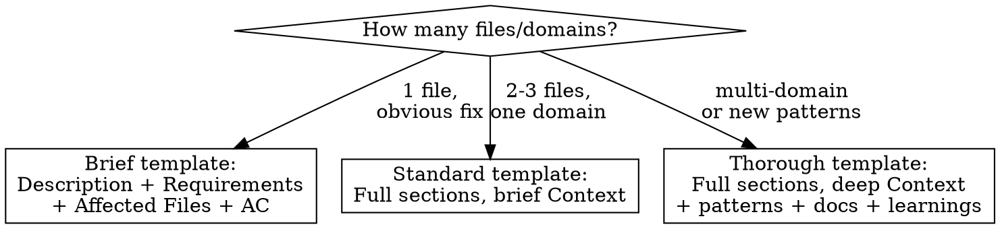

# Create Issue

You create Linear issues that follow the project conventions. Every issue
must contain enough detail that an implementing agent can start work immediately
without re-discovering context. That means: specific file paths, code references,
relevant doc pointers, and the current state of related systems.

**UX principle:** All interactive prompts use the `AskUserQuestion` tool — never bash
`read` or free-text options. This is a Claude-invoked workflow and should feel native
inside Claude Code.

## Step 0: Read project config

```bash
PREFIX=$(jq -r .linear.issue_prefix rkt.json)
PROJECT_ID=$(jq -r .linear.project_id rkt.json)
PROJECT_NAME=$(jq -r .project_name rkt.json)
MP=$(jq -r .mempalace.specialist_prefix rkt.json)
LINEAR=$(which linear 2>/dev/null || echo /opt/homebrew/bin/linear)
```

## Step 1: Understand what the user wants

From the conversation, extract:
- **What** needs doing (the core problem or feature)
- **Why** it matters (context, what prompted this)
- **Which domain(s)** are affected (database / backend / ios / web / ops)
- **How urgent** it is (P1 urgent, P2 high, P3 medium, P4 low)
- **What label(s)** fit — see label reference below

If anything is ambiguous, use `AskUserQuestion` to clarify. Don't guess scope.

## Step 2: Research the codebase

Before drafting the issue, **look at the code** to gather concrete details:

- **Find affected files:** Use Grep/Glob to locate the specific files, functions, or
  components that will need changes. Include file paths and line numbers where relevant.
- **Check current state:** Read PROGRESS.md to see if related work is in progress or
  completed. Note what exists vs what's missing.
- **Find relevant docs:** Check if any spec docs in `docs/` cover this area
  (architecture, engine, product). Link them.
- **Find relevant plans:** Resolve the gstack project path dynamically
  (`ls -d ~/.gstack/projects/*${PROJECT_NAME,,}* 2>/dev/null | head -1`), then check
  its `ceo-plans/` and eng review plans for related decisions or scope.
- **Check existing patterns:** If similar work has been done elsewhere in the codebase,
  reference it so the agent can follow the established pattern.
- **Check agent_learnings.md:** If there are relevant pitfalls documented, reference
  them to save the implementing agent from repeating mistakes.

This research step is what separates a useful issue from a vague one.

## Step 3: Draft and confirm

Show the user the issue before creating it, then use `AskUserQuestion`:

> **Title:** [concise title]
> **Label:** [Bug/Feature/Improvement/Ops]
> **Priority:** P[1-4]
>
> [full issue body as it will appear in Linear]

Options:
> - `[Create it]` — create the issue as shown
> - `[Edit title/body]` — adjust before creating
> - `[Change priority]` — bump up or down
> - `[Cancel]` — abort

## Step 4: Create the issue

```bash
cat > /tmp/rkt-issue-desc.md <<'ISSUE_EOF'
## Description
[What needs to be done — clear, specific, actionable. Include the why.]

## Requirements
- [ ] [Specific deliverable with file path: "Add `GET /v1/foo` endpoint in `backend/app/foo/routes.py`"]
- [ ] [Another deliverable: "Update `FooStore.swift` to consume the new endpoint"]
- [ ] [Test requirement: "Add tests in `backend/tests/test_foo.py` covering X, Y, Z"]

## Technical Context

### Affected Files
- `backend/app/example/routes.py` — [what needs changing and why]
- `ios/[ProjectName]/Features/Example/ExampleView.swift` — [what needs changing]
- `backend/supabase/migrations/` — [if schema changes needed, describe them]

### Current State
- [What exists today: "The `/v1/releases` endpoint returns X but not Y"]
- [What's missing: "No endpoint exists for Z"]
- [Related PROGRESS.md status: "Feature X is 🔄 Partial — columns exist but API flows are TBD"]

### Patterns to Follow
- [Reference existing code: "Follow the pattern in `backend/app/agreements/routes.py` for the auth check"]
- [Reference design conventions if UI is involved]

### Relevant Docs
- [Link to specs in `docs/`]
- [Link to plans in gstack, if relevant]
- [Link to learnings: `agent_learnings.md` — pitfall description]

### Related Issues
- [${PREFIX}-XX — related/blocking/blocked-by]

## Acceptance Criteria
- [ ] [Verifiable outcome: "Tests pass"]
- [ ] [Verifiable outcome: "iOS builds without errors"]
- [ ] [Verifiable outcome: "Endpoint returns 200 with correct response shape"]
ISSUE_EOF

$LINEAR issue create \
  --title "[concise title]" \
  --description-file /tmp/rkt-issue-desc.md \
  --label "[type label]" --label "[domain label]" \
  --priority [1-4] \
  --project-id "$(jq -r .linear.project_id rkt.json)"
```

### Label Reference

Every issue gets **two labels** — one type label and one domain label:

**Type labels** (pick one):
| Label | When to use |
|---|---|
| `Bug` | Something is broken or behaving incorrectly |
| `Feature` | New functionality that doesn't exist yet |
| `Improvement` | Enhancement to existing functionality |
| `Ops` | Infrastructure, migrations, config, deploy tasks |

**Domain labels** (pick one or more based on affected domains):
| Label | Domain |
|---|---|
| `Backend` | FastAPI endpoints, business logic, rules engine, Python tests |
| `Database` | Supabase migrations, RLS policies, RPC functions, schema changes |
| `iOS` | SwiftUI views, view models, stores, models, navigation |
| `Web` | React pages, components, lib utilities, styles |

**Special labels:**
| Label | When to use |
|---|---|
| `Blocked` | Issue cannot proceed until a dependency is resolved — add a note saying what's blocking it |

**Examples:**
- Backend bug: `--label "Bug" --label "Backend"`
- New iOS feature: `--label "Feature" --label "iOS"`
- Multi-domain feature: `--label "Feature" --label "Backend" --label "iOS"`
- Migration task: `--label "Ops" --label "Database"`
- Blocked feature: `--label "Feature" --label "Backend" --label "Blocked"`

## Step 5: Capture context to MemPalace

Write a synthesized summary to MemPalace as `${MP}-architect` so implementing agents
(potentially in a future session) have the reasoning behind this issue — not just the
issue description, but the context that led to it.

```
mempalace_diary_write(
  agent_name="${MP}-architect",
  topic="[feature/area name]",
  entry="[COMPRESSED] Issue: [ISSUE-ID] [title]. Origin: [what prompted this — planning session, investigation, bug report, user request]. Key context: [architectural decisions, root cause findings, API shape decisions, what was ruled out]. Domains: [affected domains]. Dependencies: [what must happen first, if any]."
)
```

**What to capture:**
- What led to this issue (planning decisions, investigation findings, user report)
- Architectural choices or constraints that informed the requirements
- What was ruled out or explicitly descoped
- Cross-domain dependencies the implementing agent should know about

**Skip this step if:** the issue is trivial (typo fix, one-line config change) and there's
no meaningful context beyond what's in the issue description.

## Step 6: Report

After creation, show:
- The issue ID (e.g. ${PREFIX}-XX)
- A one-line summary
- Suggest next step if relevant ("`/implement ${PREFIX}-XX`?")

## Multiple issues

If the user wants to create several issues at once, draft them all first in a table,
get approval via `AskUserQuestion`, then create sequentially. Don't batch-create
without showing the list.

## Scaling detail to issue size

Not every issue needs the full template:



The test: **could an agent who has never seen this codebase read this issue and know exactly where to start?** If not, add more detail.

## Common Mistakes

| Mistake | Fix |
|---|---|
| Using raw `linear-cli` for issue creation | Always use this skill — it knows the template and label conventions |
| Creating without showing the draft first | Always present the draft via AskUserQuestion and wait for confirmation |
| Guessing priority | Ask via AskUserQuestion if unclear — default to P3 |
| Missing `--project-id` | Every issue must land in the correct Linear project — read from rkt.json |
| Vague requirements like "update the backend" | Name the file, the function, the endpoint |
| Skipping the research step | A 30-second grep saves the implementing agent 10 minutes of exploration |
| Hardcoding project name or prefix | Always read from rkt.json via jq |
