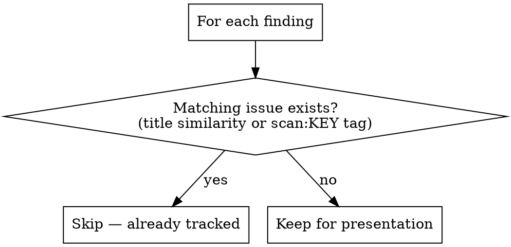

# Scan — Codebase Audit → Linear Issues

You audit the codebase systematically, identify real issues, and create Linear issues
for each one. The goal: the user opens Linear and sees a prioritised, actionable backlog
that reflects the actual state of the project.

**UX principle:** All interactive prompts use the `AskUserQuestion` tool — never bash
`read` or free-text options. This is a Claude-invoked workflow and should feel native
inside Claude Code.

## Step 0: Read project config

```bash
PREFIX=$(jq -r .linear.issue_prefix rkt.json)
PROJECT_ID=$(jq -r .linear.project_id rkt.json)
PROJECT_NAME=$(jq -r .project_name rkt.json)
LINEAR=$(which linear 2>/dev/null || echo /opt/homebrew/bin/linear)
```

## Step 1: Read context (parallel)

Read these files to understand where the project stands:

- `PROGRESS.md` — the living implementation state. Items marked ⬜ or 🔄 are potential issues.
- `OPS.md` — pending ops tasks (migrations not promoted, env vars not set).
- `INDEX.md` — phase sequence (to scope the scan to current + next phase only).
- `decisions.md` — what has been decided, to avoid filing issues for intentional gaps.
- `docs/decisions/agent_learnings.md` — pitfalls that may imply unfixed code problems.

Also read the gstack project data (these live outside the repo but contain plan
artifacts and learnings). **Resolve the project path dynamically** — do not hardcode it:

```bash
# Find the gstack project directory for this project
GSTACK_DIR=$(ls -d ~/.gstack/projects/*${PROJECT_NAME,,}* 2>/dev/null | head -1)
```

Then read from `$GSTACK_DIR`:
- `$GSTACK_DIR/learnings.jsonl` — gstack learnings (pitfalls, patterns, architecture notes). Filter for entries where the underlying issue may not be fully resolved.
- `$GSTACK_DIR/ceo-plans/*.md` — CEO plans with accepted scope. Cross-reference against PROGRESS.md to find accepted items that haven't been built yet.
- `$GSTACK_DIR/rocket-main-eng-review-test-plan-*.md` — eng review plans with edge cases and test plans. Check if edge cases have corresponding tests or handling.

If multiple `*${PROJECT_NAME,,}*` directories exist, prefer the one without `-dev` suffix
(that's the current active project).

## Step 2: Run the scans

Work through these scan layers. For each finding, note: what the issue is, which
domain it belongs to (database/backend/ios/web/ops), and a suggested label (Bug,
Feature, or Improvement).

### Layer 1: PROGRESS.md gap analysis

For the **current phase only** (check INDEX.md for which phase is current):
- Every ⬜ item is a potential Feature issue
- Every 🔄 item needs a "complete X" issue
- Check if any ✅ items have caveats in their Notes column that imply incomplete work

### Layer 2: CEO plan → unbuilt accepted scope

Read each CEO plan. For every item with Decision = ACCEPTED:
- Check PROGRESS.md for a matching ✅ entry
- If no match exists, that's a Feature issue
- If a partial match exists (🔄), note what's remaining

### Layer 3: Code-level gaps

Scan the actual codebase:

```
# TODOs/FIXMEs in code
grep -rn "TODO\|FIXME\|HACK\|XXX\|WORKAROUND" backend/app/ ios/ web/src/ --include="*.py" --include="*.swift" --include="*.ts" --include="*.tsx"

# Missing test coverage — routes without corresponding test files
ls backend/app/*/routes.py → check each has a test_*.py counterpart

# Missing RLS — check if any table created in migrations lacks RLS policies
grep -l "CREATE TABLE" backend/supabase/migrations/*.sql → cross-ref with RLS migration
```

Adapt these patterns to the actual project structure. If the project uses a different
folder layout (e.g. Next.js `app/` instead of `web/src/`), adjust accordingly.

### Layer 4: Security and robustness

- Endpoints missing input validation (raw dict access without Pydantic)
- Missing error handling (bare except, missing try/catch on external calls)
- Any endpoint accessible without auth that should be protected

### Layer 5: Eng review edge cases

Read the eng review test plans. For each edge case listed:
- Check if there's a test covering it
- Check if the code handles it
- If neither, that's a Bug or Improvement issue

### Layer 6: Ops gaps

From OPS.md:
- Pending migration promotions
- Unconfigured auth providers
- Missing environment variables
- These become Improvement issues tagged with "Ops"

## Step 3: Deduplicate against existing Linear issues

Before creating any issues, check what already exists across the entire project —
not just issues assigned to you:

```bash
$LINEAR issue list --project-id "$(jq -r .linear.project_id rkt.json)" --all-states --no-pager
```



**Critical:** `linear issue mine` only returns issues assigned to you — it misses the
entire unassigned backlog. Always use `issue list --project-id` to get everything.

## Step 4: Enrich findings with codebase details

For each finding from Step 2, before presenting to the user, **look at the code** to add:

- **Affected files** — grep/glob for the specific files that will need changes
- **Current state** — what exists, what's missing, what's partially done
- **Patterns to follow** — if similar work exists elsewhere, reference it
- **Relevant docs** — specs in `docs/`, plans in gstack, pitfalls in `agent_learnings.md`

This research is what makes the difference between "Add email verification" (useless)
and "Add email verification gate in `ios/[Project]/Features/Onboarding/` following the
pattern in `VerifyEmailView.swift`" (actionable).

## Step 5: Present findings for approval

Before creating issues, show the full list in a table, then use `AskUserQuestion`:

```
| # | Title | Label | Domain | Priority | Source |
|---|-------|-------|--------|----------|--------|
| 1 | ...   | Bug   | backend| P2       | eng-review edge case |
| 2 | ...   | Feature | ios  | P3       | CEO plan accepted    |
```

Options:
> - `[Create all]` — create every finding as a Linear issue
> - `[Let me pick]` — select individual items to create
> - `[Cancel]` — abort, don't create anything

If the user picks "Let me pick", present each finding with `AskUserQuestion` one at a
time with `[Create]` / `[Skip]` options.

## Step 6: Create issues via `/create-issue`

For each approved finding, invoke the `/create-issue` skill. This ensures every issue
follows the standard template, gets proper labels, and writes to MemPalace
(`${MP}-architect`) automatically.

For each finding, tell `/create-issue`:
- What needs doing and why (from your scan findings)
- Which domain(s) are affected
- The suggested label(s) and priority
- The enriched details from Step 4 (affected files, current state, patterns, docs)
- Add `<!-- [scan:UNIQUE_KEY] -->` to the description for future deduplication

Create issues sequentially (not in parallel) to avoid rate limits.

## Step 7: Report

After all issues are created, summarise:

```
Created X issues in Linear:
- Y Bugs
- Z Features
- W Improvements

Highest priority:
1. [P1] ${PREFIX}-XX: ...
2. [P2] ${PREFIX}-YY: ...
```

## Common Mistakes

| Mistake | Fix |
|---|---|
| Creating issues for future phases | Only scan current phase unless user explicitly asks |
| Filing issues for intentional gaps | Check decisions.md first — if it was a deliberate decision, skip it |
| Duplicate issues in Linear | Always dedup with `issue list --project-id` — not `issue mine` |
| Creating issues without approval | Present the findings table via AskUserQuestion first, wait for user to pick |
| Vague issues like "improve error handling" | Name the endpoint, the error case, and the fix shape |
| Missing domain labels | Every issue needs a type label AND a domain label (see `/create-issue`) |
| Hardcoded gstack paths | Always resolve dynamically — project names change over time |
| Using `--project "Name"` instead of `--project-id` | Read project_id from rkt.json for reliable targeting |
